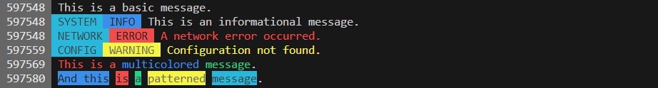

# ChromaLog Library

The `ChromaLog` library offers colorful logging for ESP32 platforms. It enriches your log messages with vibrant colors to make them stand out, improving readability and debugging efficiency.

## Features

- **Customizable Coloring**: Choose from a range of colors to make your logs expressive.
- **Pattern Processing**: Include special patterns in your logs to dynamically alter their appearance.
- **Thread Safety**: Incorporates FreeRTOS semaphores to ensure that log operations are thread-safe on ESP32.
- **Conditional Logging**: Easily toggle logging on or off with a compiler directive.

## Installation using PlatformIO

PlatformIO offers a streamlined way to manage your project dependencies.

1. Open your platformio.ini file in the root of your project.
2. Add the following line under your environment's lib_deps:

```
lib_deps =
	https://github.com/SlimeCodex/ChromaLog@^1.0.0
```

3. Save the `platformio.ini` file.
4. Build your project. PlatformIO will automatically fetch and install the ChromaLog library.

## Enabling ANSI Coloring in PlatformIO

For the colorful log messages generated by `ChromaLog` to be displayed correctly in PlatformIO's serial monitor, you'll need to enable raw mode. This ensures that the ANSI color codes used by the library are interpreted correctly, allowing for the intended colorful output.

To enable raw mode in the serial monitor:

1. Open your platformio.ini file.
2. Under your environment settings, add the following line:

```
monitor_raw = yes
```

3. Save the platformio.ini file.

## Basic Usage

### Including the Library

```cpp
#include <ChromaLog.h>
```

### Logging with ChromaLog

```cpp
CHROMA_LOG("This is a log message with an ~red(Error)~ message inside.");
```

Color names can be used within the tilde and parentheses pattern to colorize specific parts of your log messages.

### Setting Global Flags with PlatformIO

In the `platformio.ini` file, you can define various build flags to customize the behavior of the ChromaLog library.

Here's a breakdown of the ChromaLog specific flags:

```cpp
build_flags =
	-D CHROMA_LOG_ENABLED ; Enables the output.
	-D CHROMA_LOG_TIMESTAMP ; Add a timestamp to the log output.
	;-D CHROMA_LOG_FILE_LINE ; Display the file and line number where the log is invoked.
	;-D CHROMA_LOG_FUNC ; Display the function name where the log is invoked.
	-D CHROMA_LOG_COLOR ; Enable colored output.
```

Explanation of each flag:

- **CHROMA_LOG_ENABLED**: When defined, it activates the ChromaLog output. This can be useful if you want to have a quick way to toggle logging on or off without making code changes.
- **CHROMA_LOG_TIMESTAMP**: Adds a timestamp to the beginning of each log message. This can be very handy to track the timing of various log messages.
- **CHROMA_LOG_FILE_LINE** (commented out by default): When defined, it appends the file name and line number from where the log was invoked. Useful for quick debugging.
- **CHROMA_LOG_FUNC** (commented out by default): Displays the name of the function where the log message was invoked.
- **CHROMA_LOG_COLOR**: Enables the colorized output of the log messages. If not defined, automatically removes the color pattern to print the uncolored output.

## Advanced Usage

### Custom Template Creation

ChromaLog architecture allows for custom template creation. This means you're not limited to just the provided generic templates; you can design your own tailored logging macros to fit the specific needs of your project.

### Why Create Custom Templates?

- **Project-Specific Standards**: Different projects might have distinct logging requirements. Custom templates allow you to adhere to any project-specific logging standards or formats.
- **Enhanced Readability**: With custom templates, you can add your own flair, using different colors or formats that make the logs more readable and understandable to your development team.
- **Quicker Debugging**: Tailored templates can help you pinpoint issues faster by categorizing and highlighting critical information in the manner you find most efficient.

To create a custom template, you can use the foundational `CHROMA_LOG` function and embed your desired ANSI color codes or formats. Here's a basic outline to craft your own template:

```cpp
#define MY_CUSTOM_LOG(cat, fmt, ...) CHROMA_LOG("~my_color_code( " cat " )~ " fmt, ##__VA_ARGS__)
```

Feel free to get creative! Dive into the variety of available color codes, mix and match, and design logs that are both functional and aesthetically pleasing.

Here are a few examples:

```cpp
#define GENERIC_LOG(fmt, ...) CHROMA_LOG(" " fmt, ##__VA_ARGS__)
#define GENERIC_LOGI(cat, fmt, ...) CHROMA_LOG("~bg_cyan( " cat " )~~bg_blue( INFO )~ " fmt, ##__VA_ARGS__)
#define GENERIC_LOGE(cat, fmt, ...) CHROMA_LOG("~bg_cyan( " cat " )~~bg_red( ERROR )~ ~red(" fmt ")~", ##__VA_ARGS__)
#define GENERIC_LOGW(cat, fmt, ...) CHROMA_LOG("~bg_cyan( " cat " )~~bg_yellow( WARNING )~ ~yellow(" fmt ")~", ##__VA_ARGS__)
```

```cpp
// Basic message with default formatting
GENERIC_LOG("This is a basic message.\n");

// Info message with cyan category and blue INFO tag
GENERIC_LOGI("SYSTEM", "This is an informational message.\n");

// Error message with cyan category, red ERROR tag, and red text
GENERIC_LOGE("NETWORK", "A network error occurred.\n");

// Warning message with cyan category, yellow WARNING tag, and yellow text
GENERIC_LOGW("CONFIG", "Configuration not found.\n");

// Example showing multicolored and patterned text using the templates
GENERIC_LOG("~red(This is a)~ ~blue(multicolored)~ ~green(message)~.\n");
GENERIC_LOG("~bg_blue(And this)~ ~bg_red(is)~ ~bg_green(a)~ ~bg_yellow(patterned)~ ~bg_cyan(message)~.\n");
```



## License

Distributed under the GPL-3.0 License. See the LICENSE file for more information.